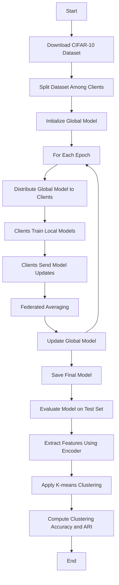

# Federated Learning with PyTorch on CIFAR-10

## Project Overview

This project implements a federated learning system using autoencoders for unsupervised learning on the CIFAR-10 dataset. The training process is distributed across multiple clients, and the model is evaluated using K-means clustering.

## Technologies and Techniques Involved

- **Federated Learning**: A machine learning technique where multiple decentralized devices collaboratively train a model without sharing raw data.
- **PyTorch**: An open-source machine learning library used for training the neural network model.
- **CIFAR-10**: A widely-used dataset for image classification tasks.
- **Multithreading and Parallel Processing**: Techniques to handle concurrent training of client models.
- **Logging and Exception Handling**: To ensure robust and traceable code execution.

## Requirements

- Python 3.8 or higher
- PyTorch
- Torchvision
- NumPy
- Matplotlib
- TQDM

## Installation

1. **Clone the repository**:
    ```sh
    git clone https://github.com/yourusername/federated-learning-pytorch.git
    cd federated-learning-pytorch
    ```

2. **Create a virtual environment**:
    ```sh
    python3 -m venv venv
    source venv/bin/activate
    ```

3. **Install the required packages**:
    ```sh
    pip install -r requirements.txt
    ```

    

## Execution

1. **Download and preprocess the CIFAR-10 dataset**.
2. **Train the federated learning model**:
    ```sh
    python3 src/image_classifier_autoencoders.py --num_clients 5 --epochs 30
    ```

- **Arguments**:
  - `--num_clients`: Number of clients to simulate.
  - `--epochs`: Number of epochs for training.
  - `--max_workers`: Maximum number of parallel workers.
  - `--batch_size`: Batch size for DataLoader.

3. **Evaluate the trained model on the test dataset**.



